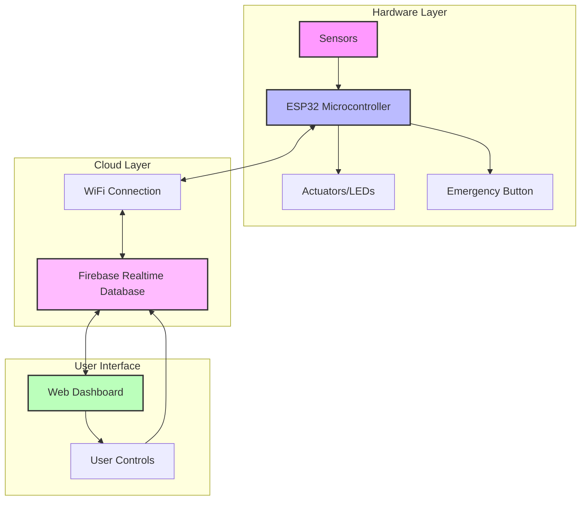

# 🌟 IoT Solar Monitoring System
### ESP32-Based Real-Time Solar Power Management Dashboard

[](https://opensource.org/licenses/MIT)
[](https://firebase.google.com/)
[](https://www.espressif.com/en/products/socs/esp32)
[](https://html.spec.whatwg.org/)
[](https://developer.mozilla.org/en-US/docs/Web/JavaScript)

> **A comprehensive IoT solution for monitoring and controlling off-grid solar power systems in crisis environments**

## 📋 Table of Contents
- [Overview](#-overview)
- [Problem Statement](#-problem-statement)
- [Features](#-features)
- [System Architecture](#-system-architecture)
- [Live Demo](#-live-demo)
- [Components](#-components)
- [Installation](#-installation)
- [Configuration](#-configuration)
- [Usage](#-usage)
- [Dashboard Interface](#-dashboard-interface)
- [API Documentation](#-api-documentation)
- [Future Improvements](#-future-improvements)
- [Contributing](#-contributing)
- [Author](#-author)
- [License](#-license)

## 🌐 Overview

The **IoT Solar Monitoring System** is a cutting-edge solution designed to address critical power management challenges in off-grid environments. Born from the urgent need to monitor solar installations in crisis situations, this project integrates an ESP32 microcontroller with Firebase cloud services and a responsive web dashboard to provide real-time monitoring, alerting, and remote control capabilities.

### 🎯 Key Objectives
- **Real-time Monitoring**: Track solar generation, battery status, and load consumption
- **Intelligent Alerting**: Multi-modal warnings for critical conditions
- **Remote Control**: Manage loads from anywhere with internet access
- **Historical Analysis**: Advanced data filtering and trend visualization
- **Crisis Response**: Designed for reliability in challenging environments

## 🚨 Problem Statement

Since October 2023, Gaza's traditional power grid has completely stopped due to ongoing conflict. Over 90% of electricity now relies on off-grid solar systems, often using low-quality components with no monitoring capabilities. This project addresses:

- **Unexpected Blackouts**: Due to unmonitored battery discharge
- **Equipment Damage**: From overloading and overheating
- **Energy Waste**: Due to unutilized solar capacity
- **Critical Failures**: Affecting medical equipment and essential services

## ✨ Features

### 🔋 Comprehensive Monitoring
- **Solar Panel Metrics**
  - Voltage (35-37V range)
  - Current (0-40A range)
  - Power output calculation
  - Efficiency tracking

- **Battery Management**
  - Voltage monitoring (22-28V)
  - Charge level percentage
  - Charging/discharging status
  - Temperature monitoring

- **Load Analysis**
  - Real-time power consumption (0-3000W)
  - Load classification (Normal/High/Overload)
  - Connection status
  - Remote control capability

### 🚨 Smart Alert System
- **Visual Alerts**: Color-coded LED indicators
- **Audible Warnings**: Buzzer for critical conditions
- **Dashboard Notifications**: Animated web alerts
- **Threshold Monitoring**:
  - Low battery (<23.5V)
  - System overload (>2000W)
  - Battery overheating (>60°C)
  - Inverter overheating (>60°C)

### 📊 Advanced Analytics
- **Time-based Filtering**: Live, 15min, 30min, 1hr, 3hr, 6hr, 24hr, 3 days
- **Historical Analysis**: Date-specific data retrieval
- **Interactive Charts**: Multi-line graphs with Chart.js
- **Statistical Insights**: Averages and trends

### 🔐 Emergency Control
- **Dual Control System**:
  - Physical emergency button on ESP32
  - Remote dashboard toggle
- **Instant Response**: Changes apply within seconds
- **Failsafe Operation**: Local control during network outages

## 🏗️ System Architecture



### Data Flow
1. **ESP32** samples sensors every 3 seconds
2. Data transmitted to **Firebase** in JSON format
3. **Dashboard** subscribes to real-time updates
4. User commands flow back through Firebase to ESP32

## 🌟 Live Demo

🔗 **[View Live Dashboard](https://haytham-420.github.io/IoT-Solar-Monitoring-ESP32-Dashboard/)**

> Might stop working when unlinking Firebase backend from this public repo

## 🔧 Components

### 1. ESP32/Wokwi Simulation
- **Platform**: [Wokwi Simulator](https://wokwi.com/)
- **Board**: ESP32 DevKit C v4
- **Sensors**:
  - 4x Analog sensors (potentiometers)
  - 2x DHT22 temperature sensors
  - 1x DS1307 RTC module
- **Outputs**:
  - 4x LED indicators (alerts)
  - 1x Buzzer (audible alerts)
  - 1x Relay module (load control)

### 2. Firebase Backend
- **Service**: Firebase Realtime Database
- **Authentication**: Anonymous auth for emergency access
- **Structure**:
  ```json
  {
    "readings": {
      "auto-generated-key": {
        "timestamp": 1754160265000,
        "pvPower": 125.4,
        "loadWatts": 89.2,
        "batteryLevel": 78.5,
        "alerts": {...}
      }
    },
    "control": {
      "shutdownLoad": false
    }
  }
  ```

### 3. Web Dashboard
- **Hosting**: GitHub Pages
- **Technologies**: HTML5, CSS3, JavaScript ES6
- **Libraries**:
  - Firebase SDK v9.22.0
  - Chart.js v3.9.1
- **Features**: Responsive, real-time, mobile-friendly

## 🛠️ Installation

### Prerequisites
- [Arduino IDE](https://www.arduino.cc/en/software) or [PlatformIO](https://platformio.org/)
- [Node.js](https://nodejs.org/) (for local testing)
- Firebase account ([Get started free](https://firebase.google.com/))
- Wokwi account (for simulation)

### 1. Clone the Repository
```bash
git clone https://github.com/YOUR_USERNAME/YOUR_REPO_NAME.git
cd YOUR_REPO_NAME
```

### 2. ESP32 Setup (Wokwi Simulation)

#### Option A: Use Wokwi Online
1. Go to [Wokwi](https://wokwi.com/)
2. Create a new ESP32 project
3. Copy `sketch.ino` content
4. Copy `diagram.json` for component layout
5. Add required libraries:
   - WiFi
   - FirebaseESP32
   - DHT
   - RTClib

#### Option B: Physical ESP32
1. Install required libraries in Arduino IDE:
```bash
# In Arduino IDE Library Manager, install:
- Firebase ESP32 Client by Mobizt
- DHT sensor library by Adafruit
- RTClib by Adafruit
```

2. Update WiFi credentials in `sketch.ino`:
```cpp
const char* ssid = "YOUR_WIFI_SSID";
const char* password = "YOUR_WIFI_PASSWORD";
```

### 3. Firebase Configuration

1. Create a Firebase project:
   - Go to [Firebase Console](https://console.firebase.google.com/)
   - Click "Create Project"
   - Enable Anonymous Authentication
   - Create Realtime Database

2. Get your config:
```javascript
// Found in Project Settings > General
const firebaseConfig = {
  apiKey: "YOUR_API_KEY",
  authDomain: "YOUR_AUTH_DOMAIN",
  databaseURL: "YOUR_DATABASE_URL",
  projectId: "YOUR_PROJECT_ID"
};
```

3. Update database rules:
```json
{
  "rules": {
    "readings": {
      ".read": true,
      ".write": "auth != null"
    },
    "control": {
      ".read": "auth != null",
      ".write": "auth != null"
    }
  }
}
```

### 4. Dashboard Deployment

1. Update Firebase config in `index.html`
2. Enable GitHub Pages:
   - Go to Settings > Pages
   - Source: Deploy from branch
   - Branch: main (or master)
   - Folder: / (root)
3. Access at: `https://YOUR_USERNAME.github.io/YOUR_REPO_NAME/`

## ⚙️ Configuration

### ESP32 Pin Configuration
```cpp
// Analog Sensors
#define SOLAR_VOLTAGE_PIN 34
#define SOLAR_CURRENT_PIN 35
#define BATTERY_VOLTAGE_PIN 32
#define LOAD_POWER_PIN 33

// Digital Sensors
#define DHT_BATTERY_PIN 26
#define DHT_INVERTER_PIN 25

// I2C (RTC)
#define SDA_PIN 21
#define SCL_PIN 22

// Outputs
#define RELAY_PIN 4
#define BUZZER_PIN 5
#define LED_LOW_BATTERY 12
#define LED_OVERLOAD 13
#define LED_BATTERY_HOT 16
#define LED_INVERTER_HOT 17

// Control
#define EMERGENCY_BUTTON_PIN 27
```

### Alert Thresholds
```cpp
const float LOW_BATTERY_VOLTAGE = 23.5;  // Volts
const float MAX_LOAD_POWER = 2000.0;     // Watts
const float MAX_BATTERY_TEMP = 60.0;     // Celsius
const float MAX_INVERTER_TEMP = 60.0;    // Celsius
```

## 📱 Dashboard Interface

### Main Components

#### 1. System Status Header
- **Connection Indicator**: Animated pulse (green/red)
- **Last Update Timer**: Time since last data
- **System Title**: "⚡ ESP32 Solar Monitor Dashboard"

#### 2. Control Panel
- **Emergency Load Toggle**: Large button for immediate control
- **Time Filter**: Dropdown for historical data
- **Date Picker**: Specific date analysis
- **Theme Toggle**: Dark/Light mode switch

#### 3. Data Cards

| Card | Metrics | Visual Elements |
|------|---------|-----------------|
| ☀️ **Solar Panel** | Voltage, Current, Power | Real-time values |
| 🔋 **Battery Status** | Level %, Voltage, Status | Animated progress bar |
| 🔌 **Load Consumption** | Power, Type, Status | Color-coded indicators |
| 🌡️ **Temperature** | Battery, Inverter | Warning thresholds |

#### 4. Interactive Chart
- **Multi-line Graph**: Solar, Battery, Load power
- **Responsive Design**: Adapts to screen size
- **Hover Details**: Tooltips with exact values

### Screenshots

<details>
<summary>📸 View Dashboard Screenshots</summary>

| Feature | Description |
|---------|-------------|
| Main Dashboard | Full system overview with all metrics |
| Alert System | Active warnings with animations |
| Historical View | Time-filtered data analysis |
| Mobile View | Responsive mobile interface |

</details>

## 📡 API Documentation

### Firebase Data Structure

#### `/readings/{key}`
```typescript
interface Reading {
  timestamp: number;           // Unix timestamp
  pvPower: number;            // Solar power (W)
  loadWatts: number;          // Load consumption (W)
  loadType: string;           // "Normal" | "High" | "Overload"
  loadEnabled: boolean;       // Load connection status
  batteryLevel: number;       // Battery percentage (%)
  batteryVoltage: number;     // Battery voltage (V)
  batteryStatus: string;      // "Charging" | "Discharging"
  batteryPower: number;       // Battery power flow (W)
  batteryTemp: number;        // Battery temperature (°C)
  inverterTemp: number;       // Inverter temperature (°C)
  solarVoltage: number;       // Solar voltage (V)
  solarCurrent: number;       // Solar current (A)
  alertLowBattery: boolean;   // Low battery alert
  alertOverload: boolean;     // Overload alert
  alertBatteryOverheat: boolean;  // Battery temp alert
  alertInverterOverheat: boolean; // Inverter temp alert
}
```

#### `/control`
```typescript
interface Control {
  shutdownLoad: boolean;      // Remote load control
}
```

### JavaScript API Usage

```javascript
// Initialize Firebase
import { initializeApp } from 'firebase/app';
import { getDatabase, ref, onValue, set } from 'firebase/database';
import { getAuth, signInAnonymously } from 'firebase/auth';

// Listen for real-time updates
const readingsRef = ref(database, 'readings');
onValue(readingsRef, (snapshot) => {
  const data = snapshot.val();
  updateDashboard(data);
});

// Send control command
const controlRef = ref(database, 'control/shutdownLoad');
set(controlRef, true);  // Disconnect load
```

## 🚀 Future Improvements

### Phase 1: Hardware Enhancement
- [ ] Real sensor integration (INA219, ADS1115)
- [ ] Professional temperature sensors (DS18B20)
- [ ] Battery Management System integration
- [ ] Weather station for environmental data

### Phase 2: Software Features
- [ ] User authentication system
- [ ] Mobile app (React Native)
- [ ] Push notifications for alerts
- [ ] PDF report generation
- [ ] Energy optimization AI

### Phase 3: Scalability
- [ ] Multi-site management
- [ ] Time-series database (InfluxDB)
- [ ] GraphQL API
- [ ] Docker containerization
- [ ] Kubernetes deployment

### Phase 4: Advanced Analytics
- [ ] Machine learning predictions
- [ ] Anomaly detection
- [ ] Predictive maintenance
- [ ] Energy forecasting
- [ ] Cost optimization

## 🤝 Contributing

Contributions are welcome! Please feel free to submit a Pull Request.

1. Fork the repository
2. Create your feature branch (`git checkout -b feature/AmazingFeature`)
3. Commit your changes (`git commit -m 'Add some AmazingFeature'`)
4. Push to the branch (`git push origin feature/AmazingFeature`)
5. Open a Pull Request

### Development Setup
```bash
# Install dependencies for local testing
npm install -g live-server

# Run local server
live-server --port=8080

# Access at http://localhost:8080
```

## 👤 Author

**Haytham Mohammed Khalil**
- Student ID: 2049011015
- Course: Internet of Things (CSE04)- August 2025
- Location: Gaza, Palestine
- Instructor: Dr. Ezzeldeen Edwan:

Assistant Professor and head of library department at PTC
ICPET IEEE conference General Co-Chair
PTC coordinator for MS@CPS, Edu4All and ICT4EDU Erasmus+ Projects
Email: ezedwan@ptcdb.edu.ps
Web: www.ptcdb.edu.ps/site/ezedwan, Tel: +97082531171/2, Mobile: +970595189775
Google Scholar: https://scholar.google.com/citations?user=j7rD_FoAAAAJ&hl=en&oi=ao
Research Gate: https://www.researchgate.net/profile/Ezzaldeen_Edwan

## 📄 License

This project is licensed under the MIT License - see the [LICENSE](LICENSE) file for details.

---

### 🌍 Impact Statement

This project was developed in response to the critical energy infrastructure challenges in Gaza, where traditional power grids have failed and communities rely entirely on unmonitored solar systems. By providing accessible monitoring and control capabilities, this system aims to:

- **Prevent** unexpected power failures affecting medical equipment
- **Optimize** limited solar resources in crisis conditions
- **Enable** remote management when physical access is dangerous
- **Support** humanitarian efforts with open-source technology

The entire project is open-source and freely available for deployment in any crisis situation worldwide.

---
## 🗃️ Additional files of this project
- [Project Report (.pdf file)](https://drive.google.com/file/d/19JM8qishBUoZc5BgdbfJHHw9lyBr9hGI/view?usp=sharing)
- [Project Presentation + Demo + code video (.mp4 file)](https://drive.google.com/file/d/1FA1nUT_wmET8rP5xN315uuVFP6nOQ97b/view?usp=sharing)
- [Presentation slides (.pdf)](https://drive.google.com/file/d/1_NJ1-4sztHSe6oT3g8nkMQEKXyu2dbJx/view?usp=sharing)
